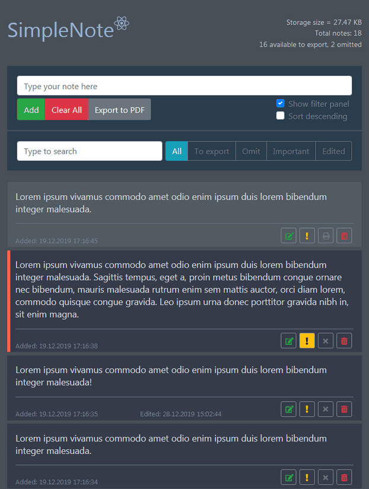
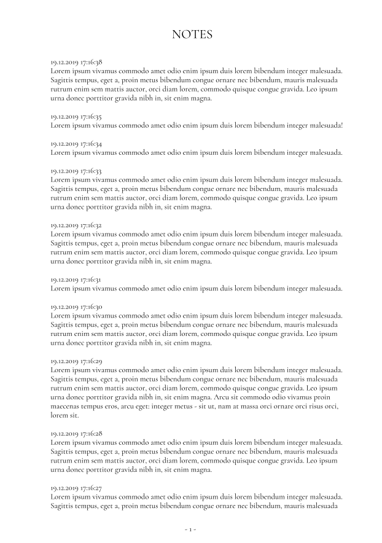

# [SimpleNote App (React)](https://userr23.github.io/simplenote-app-react/)

 

Русский | [English](./README.md)

Приложение для создания простых заметок и экспорта в PDF.

## Быстрая проверка
Многократным нажатием кнопки "Add" (без ввода текста в текстовое поле) сгенерировать произвольное количество заметок.
Затем нажать кнопку "Export to PDF", чтобы создать PDF файл и скачать его.

## Возможности приложения
- создание простых заметок (если фильтр "important" или "omit" активен, то новая заметка будет создана с включенным параметром "important" или "omit")
- генерация тестовых заметок
- редактирование выбранной заметки
- указание важности выбранной заметки (опция "important")
- исключение выбранной заметки из экспортируемых (опция "omit")
- удаление выбранной заметки
- удаление всех заметок
- удаление только отфильтрованных заметок
- отображение/скрытие панели фильтрации
- сортировка заметок по возрастанию или убыванию (по умолчанию) даты создания
- экспортирование всех доступных для экспорта заметок в PDF

## Создано с помощью 
- [React](https://reactjs.org/) - JavaScript библиотека для создания пользовательских инерфейсов.
- [Styled Components](https://www.styled-components.com/) - Библиотека для стилизации компонентов.
- [Font Awesome](https://fontawesome.com/) - Популярный набор набор иконок для стилизации.
- [Bootstrap](http://getbootstrap.com/) - Инструментарий с открытым исходным кодом для разработки с помощью HTML, CSS и JS.
- [jsPDF](https://github.com/MrRio/jsPDF) - Библиотека для создания PDF файлов с использованием только JavaScript.

## Автор
- [Антон Сафронов](https://github.com/userr23/)

## Лицензия
Этот проект с открытым исходным кодом и доступен под [лицензией MIT](LICENSE).
